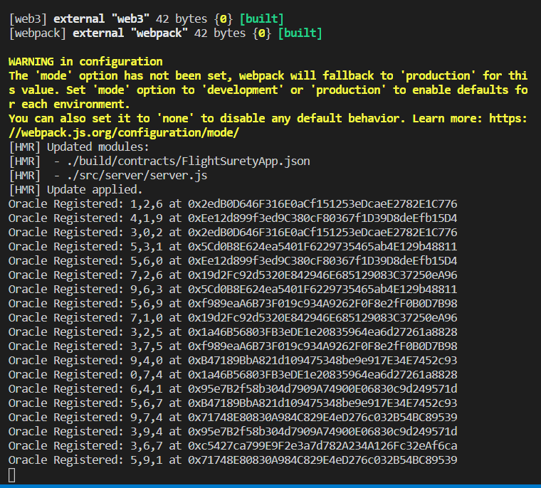

# Udacity Blockchain Developer Nanodegree Program - Project 4: FlightSurety

FlightSurety is a sample application project for Udacity's Blockchain course.

## Install

This repository contains Smart Contract code in Solidity (using Truffle), tests (also using Truffle), dApp scaffolding (using HTML, CSS and JS) and server app scaffolding.

To install, download or clone the repo, then:

`npm install`
`truffle compile`

## Develop Client

To run truffle tests:

`truffle test ./test/flightSurety.js`
`truffle test ./test/oracles.js`

To use the dapp:

`truffle migrate`
`npm run dapp`

To view dapp:

`http://localhost:8000`

## Develop Server

`npm run server`
`truffle test ./test/oracles.js`

## Deploy

To build dapp for prod:
`npm run dapp:prod`

Deploy the contents of the ./dapp folder


## Resources

* [How does Ethereum work anyway?](https://medium.com/@preethikasireddy/how-does-ethereum-work-anyway-22d1df506369)
* [BIP39 Mnemonic Generator](https://iancoleman.io/bip39/)
* [Truffle Framework](http://truffleframework.com/)
* [Ganache Local Blockchain](http://truffleframework.com/ganache/)
* [Remix Solidity IDE](https://remix.ethereum.org/)
* [Solidity Language Reference](http://solidity.readthedocs.io/en/v0.4.24/)
* [Ethereum Blockchain Explorer](https://etherscan.io/)
* [Web3Js Reference](https://github.com/ethereum/wiki/wiki/JavaScript-API)


## Getting Started

These instructions will get you a copy of the project up and running on your local machine for development and testing purposes.

### Prerequisites

Please make sure you've already installed Truffle and enabled the MetaMask extension in your browser.

### Installing

Clone this repository and install all requisite npm packages (as listed in ```package.json```):

```
npm install
```

Launch Truffle development environment:

```
truffle develop
```
Your terminal should look something like this:


Compile contracts

```
compile
```

Your terminal should look something like this:


This will create the smart contract artifacts in folder ```build/contracts```.

Migrate smart contracts to the locally running blockchain:

```
migrate
```

Your terminal should look something like this:


Test smart contracts:migrate

```
test
```

All 8 tests should pass.


In separate terminal windows, launch the server and the DApp:

```
npm run server
```
Your terminal should look something like this:




In other window 
```
npm run dapp
```
Your terminal should look something like this:


## Testing the DApp in the browser

* Go to [http://localhost:8000/](http://localhost:8000/) to open the DApp in the browser:


The first transaction is for authorizing the FlightSureryApp contract to access the FlightSuretyData contract.


* Use the accounts' private keys to import accounts in metamask. Now connect to the Contract Owner account and register airlines:


* Now select a registered airline account in MetaMask and fund the seed insurance amount:


* Select a passenger account and buy insurance, submit to oracles and if flight status is delayed (20 or 40) you can request insurance credit.


* Get insurance credit when flight is delayed


## Versions

* Truffle v5.0.2
* Solidity v0.8.3 (solc-js)
* Web3 v1.2.4
* @openzeppelin/test-helpers v0.5.15
* truffle-hdwallet-provider v1.0.17
* Node v14.15.1

## License

- **[MIT license](http://opensource.org/licenses/mit-license.php)**
